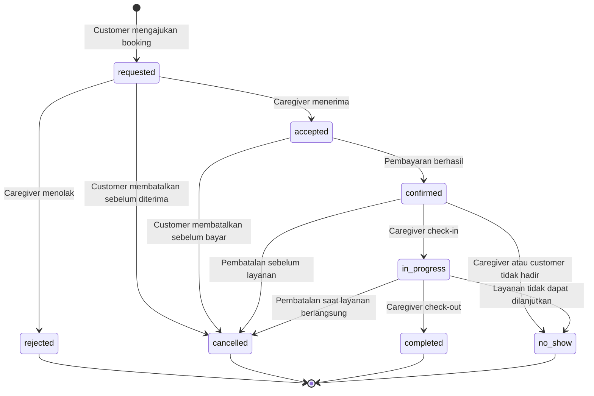
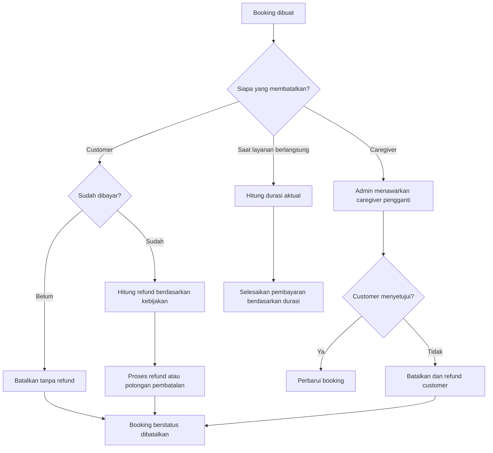

# Analisis Proses Bisnis

## Ringkasan

Booking Caregiver mempertemukan pasien atau keluarga pasien dengan caregiver untuk layanan pendampingan berbayar berdasarkan durasi waktu.

Contoh layanan:

- Menemani berobat atau kontrol
- Menemani rawat inap
- Mengantar dan menjemput pasien
- Pendampingan lansia
- Membantu administrasi sederhana selama kunjungan

## Proses Utama

1. Customer membuat akun dan mengisi kebutuhan pasien.
2. Caregiver membuat akun, melengkapi profil, dan diverifikasi admin.
3. Customer mencari caregiver berdasarkan lokasi, tarif, jadwal, rating, dan kebutuhan.
4. Customer memilih jadwal dan mengajukan booking.
5. Caregiver menerima atau menolak permintaan.
6. Sistem membuat invoice setelah booking diterima.
7. Customer membayar melalui payment gateway.
8. Sistem mengonfirmasi booking setelah pembayaran berhasil.
9. Caregiver melakukan check-in, memberikan layanan, lalu check-out.
10. Sistem menghitung durasi aktual, biaya, dan komisi platform.
11. Pendapatan caregiver diproses sesuai status transaksi.
12. Customer memberi review caregiver; caregiver memberi catatan pengalaman customer secara privat.

## Status Booking (State Machine)

Status booking harus eksplisit agar konsisten di seluruh sistem.

Daftar status:

| Status | Arti |
|---|---|
| `requested` | Permintaan diajukan, menunggu keputusan caregiver |
| `accepted` | Caregiver menerima, menunggu pembayaran |
| `rejected` | Caregiver menolak |
| `confirmed` | Pembayaran berhasil, layanan dijadwalkan |
| `in_progress` | Caregiver sudah check-in |
| `completed` | Layanan selesai, check-out tercatat |
| `cancelled` | Dibatalkan oleh customer, caregiver, atau admin |
| `no_show` | Salah satu pihak tidak hadir |

## Proses Pembatalan

## Aturan Bisnis Awal

- Booking minimum disarankan 2 jam.
- Tarif dapat ditentukan caregiver dan dapat memiliki tarif khusus malam atau hari libur.
- Slot jadwal tidak boleh dipesan ganda.
- Booking terkonfirmasi setelah pembayaran berhasil.
- Check-in dan check-out menjadi dasar perhitungan durasi aktual.
- Customer membayar tarif layanan dan biaya platform jika berlaku.
- Platform memotong komisi sebelum menyalurkan pendapatan caregiver.
- Pembatalan customer mengikuti batas waktu dan persentase refund yang ditetapkan admin.
- Pembatalan caregiver memberikan pilihan pengganti atau refund kepada customer.
- Review hanya tersedia setelah layanan selesai.
- Review caregiver terhadap customer hanya dapat dilihat caregiver terkait dan admin.

## Aturan Lembur dan Keterlambatan

- **Lembur:** layanan yang melewati jam check-out dihitung per 30 menit dengan tarif lembur (disarankan tarif normal ×1.5). Customer harus menyetujui perpanjangan sebelum lembur dimulai.
- **Keterlambatan caregiver:** caregiver yang terlambat lebih dari 15 menit wajib memberi tahu customer. Keterlambatan lebih dari 30 menit dapat dianggap `no_show` oleh customer.
- **Keterlambatan customer:** waktu layanan tetap dihitung dari jadwal check-in yang disepakati, kecuali disepakati lain.

## Penanganan No-Show

- **Customer tidak hadir:** caregiver menunggu maksimal 30 menit, lalu dapat menandai `no_show`. Customer dikenakan biaya pembatalan mendadak.
- **Caregiver tidak hadir:** customer mendapat refund penuh dan prioritas caregiver pengganti.
- **No-show saat layanan berlangsung:** biaya dihitung berdasarkan durasi aktual.

## Pencairan Pendapatan Caregiver

- Pendapatan caregiver dihitung setelah layanan `completed`.
- Pencairan dilakukan secara berkala (disarankan H+1 atau H+7) setelah masa komplain customer berakhir.
- Saldo caregiver dapat ditarik ke rekening atau e-wallet dengan nominal minimum tertentu.
- Pencairan dibatalkan atau ditahan jika ada komplain atau sengketa yang sedang berjalan.
