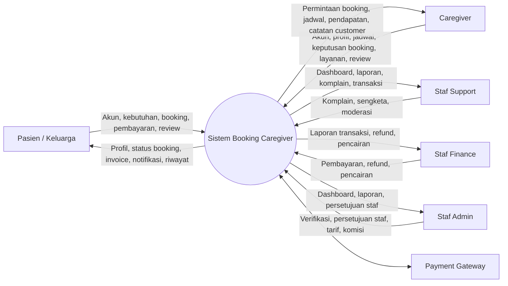
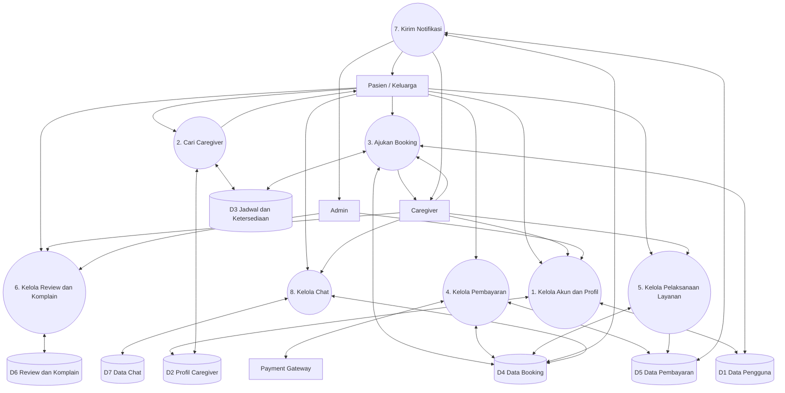

# DFD (Data Flow Diagram)

## Diagram Konteks

## DFD Level 1

## Data Store

| Kode | Data store | Isi utama |
|---|---|---|
| D1 | Data Pengguna | Identitas, kontak, role, status verifikasi |
| D2 | Profil Caregiver | Keahlian, tarif, area, rating |
| D3 | Jadwal dan Ketersediaan | Slot jadwal, status ketersediaan |
| D4 | Data Booking | Jadwal, durasi, lokasi, status, pembatalan |
| D5 | Data Pembayaran | Invoice, nominal, refund, komisi, pencairan |
| D6 | Review dan Komplain | Rating, komentar, laporan, moderasi |
| D7 | Data Chat | Pesan, pengirim, waktu, status baca |
