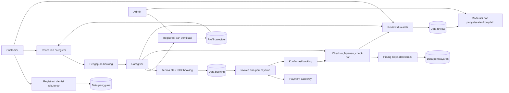
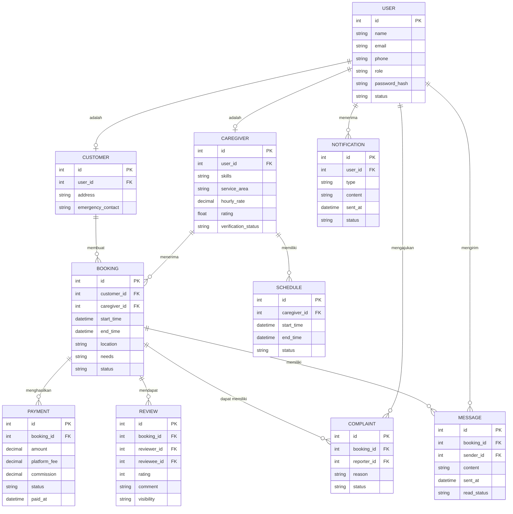

# RPD (Relational Process Diagram)

RPD di sini berarti **Relational Process Diagram**, yaitu hubungan antaraktor, proses, data, dan hasil proses.

## ERD (Entity Relationship Diagram)

RPD menggambarkan alur proses. Untuk desain database, ERD berikut melengkapi hubungan antar entitas.

