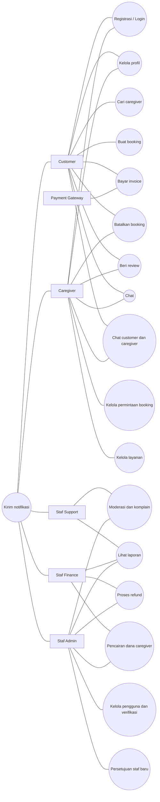

# Use Case

## Diagram Use Case

## Spesifikasi Use Case

### UC-01: Membuat Booking

- **Aktor:** Customer.
- **Prasyarat:** Customer login dan caregiver aktif.
- **Alur:** Customer memilih caregiver, tanggal, jam, durasi, lokasi, dan kebutuhan. Sistem memvalidasi jadwal, menyimpan booking `requested`, lalu caregiver menerima atau menolak.
- **Alternatif:**
  - Jika jadwal bentrok, customer memilih jadwal lain.
  - Jika caregiver menolak, customer dapat memilih caregiver lain.
  - Jika caregiver tidak merespons hingga batas waktu, booking berstatus `expired`.

### UC-02: Membayar Invoice

- **Aktor:** Customer dan payment gateway.
- **Prasyarat:** Booking diterima caregiver dan invoice tersedia.
- **Alur:** Customer memilih metode pembayaran. Gateway mengirim status berhasil. Sistem mengubah booking menjadi `confirmed` dan mengirim notifikasi.
- **Alternatif:**
  - Pembayaran gagal atau kedaluwarsa dapat dicoba ulang sesuai batas waktu.
  - Jika pembayaran tidak selesai hingga batas waktu, booking dibatalkan otomatis.

### UC-03: Membatalkan Booking

- **Aktor:** Customer atau caregiver.
- **Prasyarat:** Booking belum selesai.
- **Alur:** Aktor memilih alasan pembatalan. Sistem memeriksa waktu dan pihak pembatal, menghitung refund atau biaya, memperbarui status menjadi `cancelled`, dan mengirim notifikasi.
- **Alternatif:**
  - Jika caregiver membatalkan, customer ditawarkan caregiver pengganti atau refund penuh.
  - Jika pembatalan terjadi saat layanan berlangsung, biaya dihitung berdasarkan durasi aktual.
  - Jika pembatalan mendadak, customer dikenakan biaya pembatalan lebih besar.

### UC-04: Menyelesaikan Layanan

- **Aktor:** Caregiver.
- **Prasyarat:** Booking `confirmed`.
- **Alur:** Caregiver check-in, memberikan layanan, check-out, lalu sistem menghitung durasi aktual, biaya, dan komisi. Kedua pihak mendapat akses review.
- **Alternatif:**
  - Jika layanan diperpanjang, sistem menghitung lembur setelah persetujuan customer.
  - Jika customer atau caregiver tidak hadir, sistem menandai `no_show` dan menerapkan aturan terkait.

### UC-05: Memberi Review

- **Aktor:** Customer atau caregiver.
- **Prasyarat:** Layanan selesai.
- **Alur:** Aktor memberi rating dan komentar. Review customer tampil di profil caregiver, sedangkan review caregiver disimpan privat untuk caregiver terkait dan admin.
- **Alternatif:** Jika review mengandung hinaan, diskriminasi, atau data pribadi, admin dapat menyembunyikannya.

### UC-06: Memverifikasi Caregiver

- **Aktor:** Admin.
- **Prasyarat:** Caregiver mengirim dokumen verifikasi.
- **Alur:** Admin meninjau dokumen, menyetujui atau menolak, lalu mengubah status verifikasi caregiver.
- **Alternatif:** Jika dokumen tidak lengkap, admin meminta caregiver melengkapi.

### UC-07: Memproses Refund

- **Aktor:** Admin dan payment gateway.
- **Prasyarat:** Booking dibatalkan dan memenuhi syarat refund.
- **Alur:** Admin menyetujui refund. Sistem menghitung nominal, mengirim permintaan ke gateway, dan mencatat status refund.
- **Alternatif:** Jika refund gagal, sistem menandai untuk ditinjau manual.

### UC-08: Pencairan Dana Caregiver

- **Aktor:** Caregiver dan admin.
- **Prasyarat:** Layanan `completed` dan saldo caregiver tersedia.
- **Alur:** Caregiver mengajukan pencairan. Sistem memvalidasi saldo dan nominal minimum, lalu memproses transfer.
- **Alternatif:** Jika ada sengketa berjalan, pencairan ditahan hingga selesai.

### UC-09: Mengirim Notifikasi

- **Aktor:** Sistem.
- **Prasyarat:** Terjadi perubahan status booking, pembayaran, atau moderasi.
- **Alur:** Sistem membuat notifikasi dan mengirimkannya ke pihak terkait.
- **Alternatif:** Jika kanal notifikasi gagal, sistem mencatat dan mencoba ulang.

### UC-10: Chat Customer dan Caregiver

- **Aktor:** Customer dan caregiver.
- **Prasyarat:** Kedua pihak terlibat dalam booking yang sama.
- **Alur:** Pengguna mengirim pesan. Sistem menyimpan pesan dan menampilkannya. Frontend memuat pesan baru secara berkala (polling).
- **Alternatif:** Jika pengguna tidak terlibat dalam booking, akses chat ditolak.

### UC-11: Persetujuan Staf Admin/Platform Baru

- **Aktor:** Staf admin.
- **Prasyarat:** Staf baru telah mendaftar dan melewati verifikasi email/WhatsApp.
- **Alur:** Staf admin meninjau data staf baru, memilih peran (support, finance, atau admin), lalu menyetujui. Sistem mengaktifkan akses panel sesuai peran.
- **Alternatif:** Jika data tidak valid, staf admin menolak dan staf baru diberi tahu.
