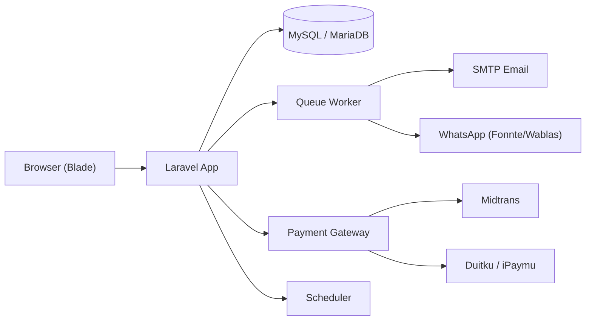

# Arsitektur Teknologi

- **Versi:** 1.0
- **Tanggal:** 2026-09-04
- **Status:** Perencanaan MVP

## Ringkasan

Web app Booking Caregiver dibangun dengan **Laravel** sebagai backend dan **Blade** sebagai frontend (server-rendered). Pendekatan ini paling sederhana untuk MVP dan mudah di-deploy ke shared hosting atau VPS murah.

## Keputusan Teknologi

| Aspek | Pilihan | Alasan |
|---|---|---|
| Backend | Laravel (PHP) | Ekosistem lengkap, mudah dipelajari, banyak dokumentasi |
| Frontend | Laravel Blade | Server-rendered, sederhana, tanpa build tooling berat |
| Ikon | Lucide | Set ikon konsisten dan ringan |
| Keamanan Form | Cloudflare Turnstile | CAPTCHA tanpa mengganggu pengguna |
| Database | MySQL / MariaDB | Umum di shared hosting, stabil |
| Payment | Midtrans + Duitku/iPaymu | Mendukung banyak metode pembayaran Indonesia |
| Chat | Polling sederhana | Tanpa server WebSocket tambahan |
| Notifikasi | Email + WhatsApp | Email via SMTP, WhatsApp via Fonnte/Wablas |
| Hosting | Shared hosting / VPS murah | Biaya rendah, cukup untuk skala awal |
| Auth | Laravel Breeze / Fortify | Autentikasi siap pakai |

## Stack Detail

### Backend
- **Laravel** (versi stabil terbaru, misal 11/12)
- **Laravel Breeze** untuk autentikasi dan role
- **Laravel Sanctum** untuk API (jika diperlukan)
- **Laravel Queue** untuk job asinkron (notifikasi, email)
- **Laravel Scheduler** untuk job terjadwal (expired booking, dll)

### Frontend
- **Laravel Blade** untuk template
- **Lucide** untuk ikon (via CDN atau package)
- **Alpine.js** untuk interaktivitas ringan (opsional)
- **Tailwind CSS** untuk styling (opsional, disarankan)

### Database
- **MySQL / MariaDB**
- **Eloquent ORM** untuk akses data
- **Migrations** dan **Seeders** untuk skema dan data awal

### Payment Gateway
- **Midtrans** (opsi utama)
- **Duitku / iPaymu** (opsi alternatif)
- Dibungkus dalam **abstraksi PaymentProvider** agar mudah menambah provider lain

### Chat
- Tabel `messages` di database
- Frontend melakukan **polling** setiap 5–10 detik
- Tanpa WebSocket di MVP

### Notifikasi
- **Email** via SMTP (Laravel Mail)
- **WhatsApp** via layanan pihak ketiga (Fonnte atau Wablas)
- **Notifikasi in-app** via tabel `notifications`
- Dibungkus dalam **abstraksi NotificationChannel** agar mudah menambah kanal lain

## Arsitektur Aplikasi

## Struktur Modul

```mermaid
flowchart TD
    Auth["Autentikasi & Role"]
    Verify["Verifikasi Pendaftaran"]
    Turnstile["Cloudflare Turnstile"]
    Profile["Profil Customer & Caregiver"]
    Search["Pencarian Caregiver"]
    Booking["Booking & Status"]
    Payment["Pembayaran & Refund"]
    Service["Check-in / Check-out"]
    Chat["Chat (Polling)"]
    Review["Review & Komplain"]
    Admin["Dashboard Admin"]
    Notif["Notifikasi"]
```

## Pola Desain

- **Repository / Service pattern** untuk memisahkan logika bisnis dari controller.
- **PaymentProvider interface** untuk abstraksi payment gateway.
- **NotificationChannel interface** untuk abstraksi kanal notifikasi (email, WhatsApp).
- **Event + Listener** untuk notifikasi dan audit log.
- **Form Request** untuk validasi input.
- **Policy** untuk otorisasi berbasis role.

## Keamanan

- **Laravel Breeze** menyediakan autentikasi aman.
- **CSRF protection** aktif secara default.
- **Password di-hash** dengan bcrypt/argon.
- **Role-based access** via middleware dan policy.
- **Data sensitif** (data medis, kontak) dibatasi aksesnya.
- **Audit log** untuk aktivitas penting.

### Cloudflare Turnstile

- Dipasang pada semua form publik, terutama **form pendaftaran** dan **form login**.
- Mencegah bot dan spam tanpa mengganggu pengguna (tidak seperti CAPTCHA tradisional).
- Validasi token Turnstile dilakukan di sisi server sebelum memproses form.
- Konfigurasi disimpan di `.env` (site key dan secret key).

### Verifikasi Pendaftaran Wajib

- **Pasien/keluarga** dan **staf admin/platform baru** wajib melewati verifikasi sebelum akun aktif.
- Staf admin/platform terdiri dari tiga peran:
  - **Support** — menangani komplain, bantuan, dan sengketa.
  - **Finance** — mengelola pembayaran, refund, dan pencairan dana caregiver.
  - **Admin** — mengelola pengguna, caregiver, tarif, komisi, dan moderasi.
- Alur verifikasi:
  1. Pengguna mendaftar dan mengisi data.
  2. Sistem mengirim kode verifikasi (email/WhatsApp).
  3. Pengguna memasukkan kode untuk mengaktifkan akun.
  4. Akun berstatus `unverified` hingga verifikasi selesai.
- Akun yang belum terverifikasi tidak dapat melakukan booking atau menerima booking.
- Staf admin/platform baru juga perlu disetujui oleh admin sebelum mendapat akses panel.
- Admin dapat melihat status verifikasi setiap pengguna.

## Deployment

- **Shared hosting / VPS murah** (misal Hostinger, DigitalOcean).
- **Nginx / Apache** sebagai web server.
- **PHP-FPM** untuk menjalankan Laravel.
- **Cron job** untuk scheduler Laravel.
- **Queue worker** untuk job asinkron (email, WhatsApp).
- **Backup database** berkala.

## Roadmap Teknis

### Fase 1: Fondasi
- Setup Laravel + Breeze
- Setup database dan migrations
- Autentikasi dan role (customer, caregiver, admin)
- Integrasi Cloudflare Turnstile pada form publik
- Verifikasi pendaftaran wajib (email/WhatsApp)

### Fase 2: Fitur Inti
- Profil customer dan caregiver
- Pencarian caregiver
- Booking dan status
- Payment (Midtrans + Duitku)
- Check-in / check-out

### Fase 3: Komunikasi dan Review
- Chat polling
- Notifikasi email + WhatsApp
- Review dan komplain
- Dashboard admin

### Fase 4: Pengujian dan Peluncuran
- Pengujian keamanan dan fungsional
- Deployment ke hosting
- Monitoring dan backup
