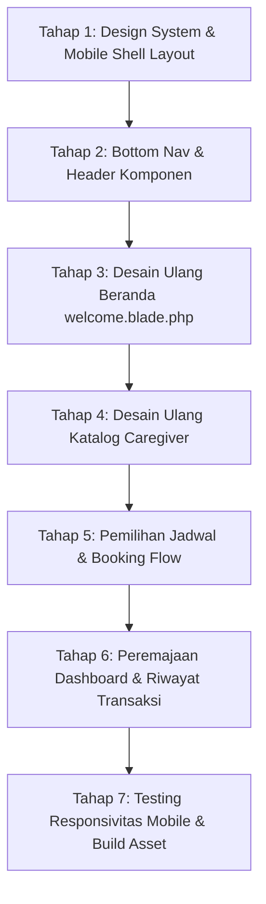

# Dokumen Perencanaan UI/UX BookingBoo (Mobile-First ala Halodoc)
**File Dokumen:** `uihalodoc.md`  
**Status:** Draf Perencanaan Implementasi  
**Target Platform:** Mobile-First Web Application (Laravel 13 + Blade + Tailwind CSS + Alpine.js)

---

## 1. Latar Belakang & Tujuan Desain

Aplikasi **BookingBoo** adalah layanan pemesanan caregiver per jam untuk pendampingan berobat ke rumah sakit, kontrol dokter, serta perawatan lansia di rumah.

Aplikasi ini menggunakan **Strategi Tata Letak Ganda (Dual-Layout Strategy)** yang disesuaikan dengan konteks kerja masing-masing peran:
1. **Pasien / Keluarga & Caregiver (Mobile-First ala Halodoc):**
   * Berorientasi penuh pada kenyamanan layar smartphone (*thumb-friendly*).
   * Bersih, terpercaya (*Medical-Grade Clean*), kartu beradius melengkung (*rounded 16–20px*), dan bayangan halus.
   * Navigasi melalui *Bottom Navigation Bar* dan tombol aksi menempel di bawah (*Sticky Bottom Action Bar*).
   * Pemilihan tanggal dan jam cepat menggunakan *Chips & Pills Selector*.
   * Jika dibuka pada layar desktop/PC, tampilan tetap elegan dan terpusat di tengah dengan proporsi smartphone yang presisi (*w-full max-w-md mx-auto* / 448px, tidak melar melebar).
2. **Admin & Staf Platform (Desktop-First Responsive):**
   * Berorientasi pada produktivitas operasional kerja di layar monitor/laptop lebar.
   * Menggunakan tata letak dashboard desktop modern: Sidebar navigasi terstruktur, grid statistik metrik yang luas, serta tabel data komprehensif untuk verifikasi dokumen KTP/STR, penanganan komplain, pencairan dana, dan moderasi akun.
   * Tetap memiliki responsivitas penuh (*collapsible sidebar & responsive tables*) apabila diakses melalui perangkat seluler saat darurat.

---

## 2. Acuan Visual Mockup

Dokumen ini disusun berdasarkan 2 rancangan visual utama:

### A. Layar Beranda Mobile (*Mobile Home Screen*)

### B. Layar Detail Caregiver & Pemilihan Jadwal (*Booking Flow*)

---

## 3. Design System & Style Guide

### 3.1 Palet Warna (*Color Palette*)
| Peran Warna | Kode HEX / Tailwind | Penggunaan |
| :--- | :--- | :--- |
| **Primary (Halodoc Red)** | `#E11D48` / `rose-600` / `crimson` | Tombol CTA utama, tab aktif navigasi, indikator penting |
| **Primary Light** | `#FFE4E6` / `rose-100` | Background chip aktif, badge promo, hover state |
| **Secondary (Medical Blue/Teal)**| `#0284C7` / `sky-600` | Link, icon pendamping RS, informasi medis netral |
| **Success (Verified Green)** | `#10B981` / `emerald-500` | Badge centang *"Terverifikasi"*, status aktif |
| **Warning / Star Gold** | `#F59E0B` / `amber-500` | Rating bintang caregiver, status booking menunggu konfirmasi |
| **Surface Background** | `#F8FAFC` / `slate-50` | Latar belakang halaman aplikasi |
| **Card / Container** | `#FFFFFF` | Permukaan kartu (*cards*), dialog modal, *bottom sheet* |
| **Text Primary** | `#0F172A` / `slate-900` | Judul, nama caregiver, tarif utama |
| **Text Secondary** | `#64748B` / `slate-500` | Deskripsi, spesialisasi, label waktu |
| **Border Soft** | `#E2E8F0` / `slate-200` | Garis batas kartu, pemisah item |

### 3.2 Tipografi
* **Font Family:** Figtree / Inter / Instrument Sans (`font-sans antialiased`).
* **Hirarki Ukuran:**
  * Header Layar: `text-lg font-bold text-slate-900`
  * Nama Caregiver: `text-base font-semibold text-slate-900`
  * Tarif & Angka Penting: `text-lg font-bold text-rose-600`
  * Body Text: `text-sm text-slate-700 leading-relaxed`
  * Caption & Label: `text-xs font-medium text-slate-500`

### 3.3 Standar Ikonografi (Wajib Menggunakan Lucide Icons)
* **Aturan Utama:** Seluruh antarmuka aplikasi **WAJIB menggunakan Lucide Icons** via package `mallardduck/blade-lucide-icons` dengan sintaks komponen Blade `<x-lucide-[nama-ikon] class="..." />`.
* **Dilarang:** Menggunakan SVG hardcoded mentah atau pustaka ikon lain agar konsistensi visual terjamin.
* **Mapping Ikon Utama:**
  * **Navigasi Bawah:** `<x-lucide-home>` (Beranda), `<x-lucide-clipboard-list>` (Riwayat), `<x-lucide-message-circle>` (Chat), `<x-lucide-siren>` (Darurat), `<x-lucide-user>` (Profil).
  * **Kategori Layanan:** `<x-lucide-hospital>` (Pendamping RS), `<x-lucide-heart-handshake>` (Rawat Lansia), `<x-lucide-stethoscope>` (Pasca Operasi), `<x-lucide-activity>` (Fisioterapi).
  * **Kartu Caregiver:** `<x-lucide-badge-check>` (Verifikasi), `<x-lucide-star>` (Rating), `<x-lucide-briefcase>` (Pengalaman), `<x-lucide-map-pin>` (Area), `<x-lucide-wallet>` (Tarif).
  * **Alur Booking:** `<x-lucide-calendar>`, `<x-lucide-clock>`, `<x-lucide-plus>`, `<x-lucide-minus>`, `<x-lucide-arrow-left>`, `<x-lucide-credit-card>`.
  * **Dashboard Admin Desktop:** `<x-lucide-layout-dashboard>`, `<x-lucide-users>`, `<x-lucide-file-check>`, `<x-lucide-refresh-cw>`, `<x-lucide-coins>`, `<x-lucide-shield-alert>`.

### 3.4 Komponen Khusus (*Special Components*)
1. **Pill Buttons & Chips:** Sudut bulat penuh (`rounded-full`), padding ringkas (`px-4 py-2`), border lembut.
2. **Cards:** Sudut melengkung (`rounded-2xl`), shadow tipis (`shadow-sm border border-slate-100`).
3. **Sticky Bottom Action Bar:** Mengambang di bagian bawah dengan `fixed bottom-0 left-0 right-0 z-40 bg-white border-t border-slate-200 p-4 shadow-lg`.
4. **Bottom Navigation Bar:** 5 ikon Lucide dengan indikator aktif berwarna merah, tetap terlihat di mobile view.

---

## 4. Rincian Arsitektur Halaman (Screen Breakdown)

### 4.1 Layar 1: Beranda (*Home / Landing Page*)
* **File Target:** `resources/views/welcome.blade.php` (Publik) & `resources/views/dashboard/customer.blade.php` (Customer Login)
* **Struktur Komponen:**
  1. **Top Bar (Bantuan Darurat, Logo Tengah & Avatar Profil):**
     * **Tombol Bantuan Darurat:** Di sisi kiri atas, tombol kapsul rose mengarah ke pusat bantuan (`/help`).
     * **Logo BookingBoo:** Berada presisi di tengah (*center*), mengarah ke `/` (*Home*).
     * **Avatar Profil di Pojok Kanan Atas:** Menampilkan foto/inisial akun dan indikator aktif. Ketika diklik, langsung mengarahkan ke `/dashboard` (atau `/login` bagi guest).
  2. **Pill Search Bar & Location Bar:**
     * Lokasi layanan cepat: `Area Layanan: Jabodetabek & Sekitarnya`.
     * Kolom pencarian kapsul rounded dengan ikon Lucide search dan placeholder *"Cari caregiver, pendamping RS, rawat lansia..."*.
  3. **Grid 4 Kategori Layanan Cepat (Icon Bulat):**
     * 🏥 **Pendamping RS** (Kontrol rutin, antre obat, pendampingan rawat inap)
     * 👵 **Perawatan Lansia** (Aktivitas harian, pengingat obat, mobilisasi)
     * 🩹 **Pasca Operasi** (Perawatan luka ringan, pendampingan pemulihan)
     * 🧘 **Fisioterapi & Terapi** (Latihan fisik & terapi gerak)
  4. **Carousel Banner Informasi / Darurat:**
     * Banner melengkung bertuliskan *"Emergency & Layanan 24/7"* dengan tombol aksi cepat.
  5. **Daftar Caregiver Terverifikasi Pilihan:**
     * Menampilkan kartu-kartu caregiver terpopuler / terdekat dengan foto nakes, badge centang hijau, rating bintang, tarif per jam, dan tombol *"Booking"*.
  6. **Bottom Navigation Bar (5 Tab Mobile):**
     * 🏠 **Beranda:** Mengarah selalu ke `/` (*Home / Welcome Page*).
     * 🔍 **Cari:** Mengarah ke katalog pencarian caregiver (`/caregivers`).
     * 📋 **Riwayat / Pesanan:** Mengarah ke daftar reservasi booking pengguna.
     * 🚨 **Bantuan:** Pusat bantuan & darurat 24/7 (`/help`).
     * 👤 **Profil:** Pengaturan profil akun (`/profile`).

---

### 4.2 Layar 2: Katalog & Filter Caregiver
* **File Target:** `resources/views/caregivers/index.blade.php`
* **Struktur Komponen:**
  1. **Top Search Bar & Quick Filter Chips (Horizontal Scroll):**
     * Tombol pil filter cepat: `⚡ Bisa Hari Ini`, `⭐ Rating 4.8+`, `💰 Tarif Terendah`, `📍 Terdekat`.
  2. **Daftar Kartu Caregiver (Mobile Card View):**
     * Layout horizontal: Foto di sisi kiri, informasi nakes di tengah (nama, gelar, pengalaman kerja, tag spesialisasi), tarif dan tombol *"Pilih Jadwal"* di sisi kanan/bawah.
  3. **Bottom Sheet Filter (Modal Geser Bawah):**
     * Modal slide-up untuk memfilter berdasarkan: Area Kota/Kecamatan, Rentang Tarif Slider, dan Kategori Keahlian.

---

### 4.3 Layar 3: Detail Caregiver & Pemilihan Jadwal
* **File Target:** `resources/views/caregiver/public.blade.php` & `resources/views/customer/bookings/create.blade.php`
* **Struktur Komponen:**
  1. **Header Profil Lengkap:**
     * Tombol kembali (`←`), foto nakes, nama lengkap, gelar (mis. *Siti Rahma, S.Kep*), badge terverifikasi, rating ulasan, jumlah pengalaman (*5 tahun pengalaman*).
  2. **Tag Spesialisasi & Ulasan:**
     * Chips keahlian medis dan cuplikan review positif pasien sebelumnya.
  3. **Horizontal Date Picker (Pills):**
     * Deretan kapsul tanggal: `[Hari ini, 5 Sep]` (aktif), `[Besok, 6 Sep]`, `[Min, 7 Sep]`, dst.
  4. **Time Slot Chips (Grid 3 Kolom):**
     * Tombol slot jam mulai: `08:00`, `10:00`, `13:00`, `15:00`, `17:00`, `19:00`.
     * Slot yang sudah terisi otomatis berwarna abu-abu redup (*disabled*).
  5. **Durasi Pendampingan Stepper:**
     * Tombol minus/plus: `[-] 3 Jam [+]` dengan indikator jam selesai otomatis dihitung.
  6. **Form Lokasi & Kebutuhan Pasien:**
     * Input alamat rumah sakit / alamat rumah penjemputan.
     * Catatan kondisi pasien (misal: kursi roda, butuh bantuan oksigen).
  7. **Sticky Bottom Action Bar:**
     * Sisi kiri: Total kalkulasi biaya (*Rp 225.000*).
     * Sisi kanan: Tombol *"Lanjut Pembayaran"* (merah rose).

---

### 4.4 Layar 4: Detail Pemesanan, Live Chat & Absensi
* **File Target:** `resources/views/customer/bookings/_detail.blade.php` & `resources/views/booking/_chat.blade.php`
* **Struktur Komponen:**
  1. **Visual Stepper Status:** 5 tahapan proses berbentuk progress bar elegan (*Diajukan $\rightarrow$ Diterima $\rightarrow$ Terkonfirmasi $\rightarrow$ Berjalan $\rightarrow$ Selesai*).
  2. **Tombol Absensi Caregiver:** Tombol satu-tap untuk *Check-in* (saat tiba) dan *Check-out* (saat selesai) dengan pencatatan menit aktual.
  3. **Live Chat Box:** Tampilan chat gelembung pesan instan (pasien di kanan warna merah/ungu muda, caregiver di kiri warna putih).
  4. **Form Rating Bintang & Komplain:** Rating interaktif 1–5 bintang setelah selesai.

---

### 4.5 Layar 5: Pusat Bantuan & Kontak Darurat
* **File Target:** `resources/views/help.blade.php`
* **Struktur Komponen:**
  1. **Tombol Panggilan Cepat Ambulans 119:** Tombol darurat merah tebal.
  2. **Hotline & WhatsApp Support 24/7:** Satu tap langsung membuka dialer telepon atau WhatsApp.
  3. **Pusat Komplain & FAQ Bantuan:** Accordion solusi kendala booking dan sengketa layanan.

---

## 5. Rencana Kerja Implementasi Bertahap (Roadmap)

### Tahap 1: Setup Design System & Dual Layout Wrapper
* Memperbarui `tailwind.config.js` dengan token warna Halodoc (Rose/Crimson, Slate, Emerald).
* Membuat komponen **Mobile Layout Shell** (`resources/views/layouts/mobile.blade.php`) untuk Tamu, Pasien, dan Caregiver dengan kontainer terpusat di layar desktop (`max-w-md mx-auto sm:max-w-xl`).
* Membuat komponen **Admin Dashboard Layout** (`resources/views/layouts/admin.blade.php`) untuk Admin, Finance, dan Support dengan sidebar navigasi desktop yang rapi, topbar profil staf, dan container data table lebar yang responsif.

### Tahap 2: Komponen Navigasi Mobile
* Membuat komponen **Bottom Navigation Bar** (`resources/views/components/mobile-bottom-nav.blade.php`).
* Membuat komponen **Mobile Top Bar & Search** (`resources/views/components/mobile-header.blade.php`).
* Mengganti logo Laravel default dengan logo resmi **BookingBoo** di `application-logo.blade.php`.

### Tahap 3: Implementasi Beranda Mobile (`welcome.blade.php`)
* Mengganti halaman default Laravel dengan Beranda BookingBoo berfitur lengkap: Location Bar, Search, Quick Category Icons, Promo/Emergency Card, dan List Caregiver Pilihan.

### Tahap 4: Katalog & Filter Caregiver (`caregivers/index.blade.php`)
* Mengadopsi filter pill horizontal dan kartu caregiver ringkas ala mobile app.

### Tahap 5: Halaman Booking & Pemilihan Jadwal
* Mengubah input datetime standar menjadi Date Picker Pills + Time Slot Chips + Durasi Stepper.
* Menambahkan Sticky Bottom Action Bar untuk ringkasan biaya instan.

### Tahap 6: Detail Booking, Chat, & Dashboard
* Merapikan tampilan detail booking, bubble chat, dan dashboard customer agar senada dengan UI Halodoc.

### Tahap 7: Verifikasi & Pengujian
* Menguji hot-reload Vite (`npm run build`).
* Menguji tampilan responsif pada resolusi HP (iPhone, Android) dan desktop.
